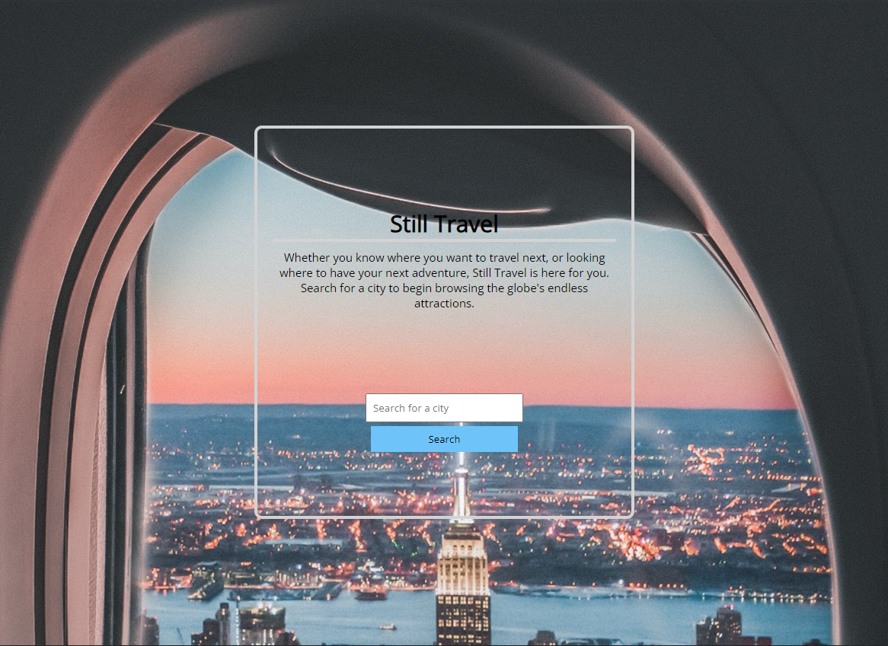
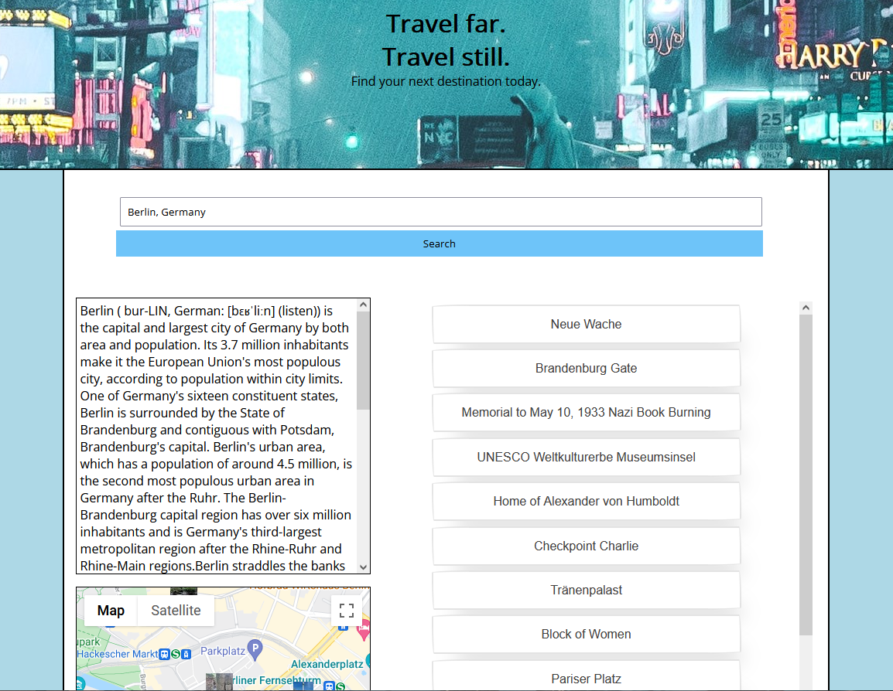

# Still Travel

## About The Project

Still travel is a one stop visit for finding your next vacation destination. For those interested in the attractions of any city in the world, this site serves as an invaluable resource to wade the waters of the art and culture one might experience upon their visit. As the title of the app suggests, it allows one to simply travel to a place while sitting still, potentially thousands of miles away. It needn't be just a device for planning a trip, but can serve as the vehicle for <i>taking</i> a trip. With images and descriptions of attractions all around the world, generated upon search, users can learn something about whatever city they can find the name of. 
 
 

* Upon first visit users will be greeted with a landing page that introduces them to the concept of the app and a minimalized UI -- just a search bar -- to ease them into the experience of the app. 
 

 

* After their first search, the information of the respective city will be brought up. 

 

 
 

* In this instance the user has searched for Berlin and we can see that some general information on the city, a map, and a list of attractions is generated. The user can click any of these attraction buttons and have an updated description of that place (if one isn't available through the Wikipedia text content API being used, a link to a relevant wikipedia article is put in it's place), an image of it placed below the button, and the recentering of the map onto the location of that attraction.

(<a href="#about-the-project">back to top</a>)

## Built With

This application is a client-side only serverless application.

### Code

- HTML
- JavaScript
- CSS

### Third-party
- [Tailwind CSS](https://tailwindcss.com/)
- [Google Maps and PLaces APIs](https://console.developers.google.com/apis/)
- [Wikipedia API](https://www.mediawiki.org/wiki/API:Main_page)

(<a href="#about-the-project">back to top</a>)

## Getting Started 

For Developers who'd like to use this project create a Google API key from the link listed for Google APIs in the built with section. Place you Google API key in Google script load found at the bottom of each HTML page.

The application can be hosted at the provider of your choice or locally with the server of you choice. Just ensure the index.html is in you web root. 

(<a href="#about-the-project">back to top</a>)

## Roadmap

- [ ] Adding a bookmark of favorite locations for future visits 
- [ ] Adding nav hamburger style menu
- [ ] Further API integration with Hotel/Flight partners
- [ ] Mobile friendly experience add features for small screens 

(<a href="#about-the-project">back to top</a>)

## Contributing

Contributions are what make the open source community such an amazing place to learn, inspire, and create. Any contributions you make are greatly appreciated.

If you have a suggestion that would make this better, please fork the repo and create a pull request. You can also simply open an issue with the tag "enhancement". Don't forget to give the project a star! Thanks again!

Fork the Project
Create your Feature Branch (git checkout -b feature/AmazingFeature)
Commit your Changes (git commit -m 'Add some AmazingFeature')
Push to the Branch (git push origin feature/AmazingFeature)
Open a Pull Request

(<a href="#about-the-project">back to top</a>)

## Contact

Ben Christensen 

[Project Repo](https://github.com/b-e-christensen)

Chris D.

[Github](https://github.com/anon123123123)

(<a href="#about-the-project">back to top</a>)
